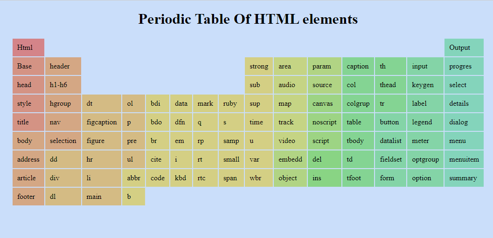

# Proyek Tabel Periodik

Proyek ini adalah halaman HTML yang menampilkan tabel periodik unsur-unsur kimia.

## Deskripsi

Halaman `table.html` menyajikan informasi dasar tentang unsur-unsur yang terdapat dalam HTML-nya.

## Cara Menjalankan

1. **Pastikan Anda memiliki XAMPP atau server lokal lainnya.**
2. **Tempatkan file `table.html` di dalam direktori `htdocs` di XAMPP.**
3. **Buka browser dan masukkan URL berikut:**
http://localhost/git/periodic/table.html

## Teknologi yang Digunakan

- **HTML**: Struktur halaman dan juga warna langsung.
## Kontak

Untuk pertanyaan lebih lanjut, silakan hubungi [My-Email](wahidaidil2460@gmail.com).